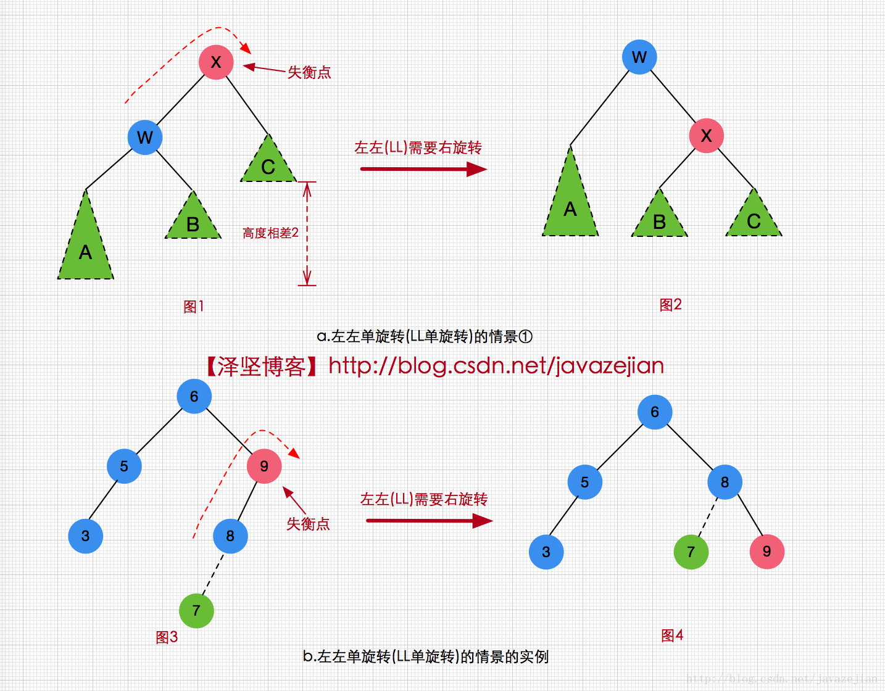
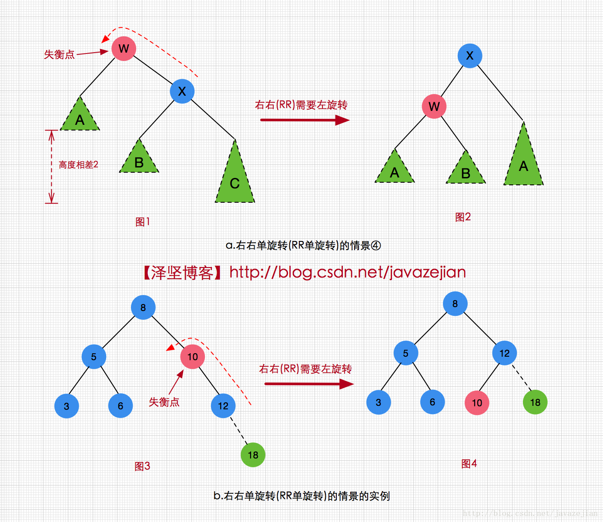
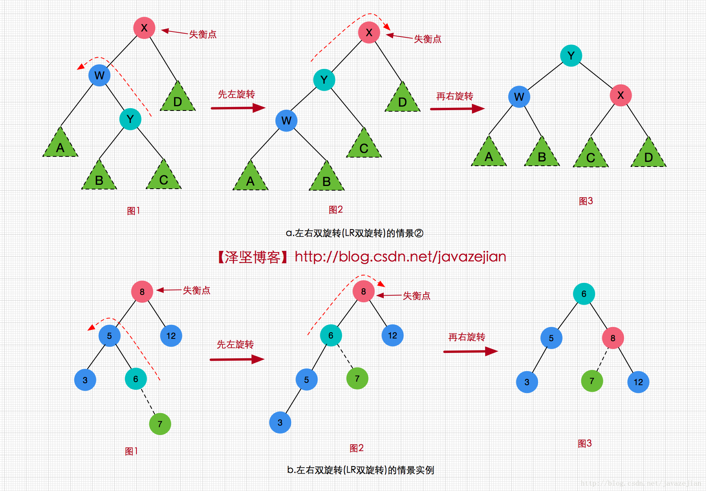
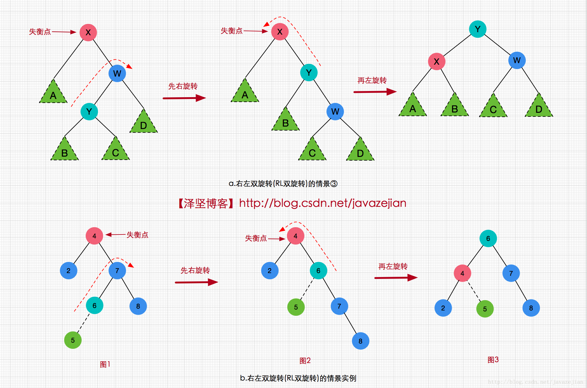

# 二叉平衡树

```java
public class AVLNode<T extends Comparable> {
    public AVLNode<T> left;//左结点
    public AVLNode<T> right;//右结点
    public T data;
    public int height;//当前结点的高度
}

```

* LL 旋转 需要右旋转</br>



```java
private AVLNode<T> singleRotateLeft(AVLNode<T> x){
    AVLNode<T> w=  x.left;
    x.left=w.right;
    w.right=x;
    x.height=Math.max(height(x.left),height(x.right))+1;
    w.height=Math.max(height(w.left),x.height)+1;
    return w;
}
```


* RR 旋转 需要左旋

```java
private AVLNode<T> singleRotateRight(AVLNode<T> w){

    AVLNode<T> x=w.right;

    w.right=x.left;
    x.left=w;

    //重新计算x/w的高度
    w.height=Math.max(height(w.left),height(w.right))+1;
    x.height=Math.max(height(x.left),w.height)+1;

    //返回新的根结点
    return x;
}

```


* LR 



* RL 



<br>
* 插入

```java
public void insert(T data) {
   if (data==null){
       throw new RuntimeException("data can\'t not be null ");
   }
   this.root=insert(data,root);
}

private AVLNode<T> insert(T data , AVLNode<T> p){

   //说明已没有孩子结点,可以创建新结点插入了.
   if(p==null){
       p=new AVLNode<T>(data);
   }else if(data.compareTo(p.data)<0){//向左子树寻找插入位置
       p.left=insert(data,p.left);

       //插入后计算子树的高度,等于2则需要重新恢复平衡,由于是左边插入,左子树的高度肯定大于等于右子树的高度
       if(height(p.left)-height(p.right)==2){
           //判断data是插入点的左孩子还是右孩子
           if(data.compareTo(p.left.data)<0){
               //进行LL旋转
               p=singleRotateLeft(p);
           }else {
               //进行左右旋转
               p=doubleRotateWithLeft(p);
           }
       }
   }else if (data.compareTo(p.data)>0){//向右子树寻找插入位置
       p.right=insert(data,p.right);

       if(height(p.right)-height(p.left)==2){
           if (data.compareTo(p.right.data)<0){
               //进行右左旋转
               p=doubleRotateWithRight(p);
           }else {
               p=singleRotateRight(p);
           }
       }
   }
   else
    ;//if exist do nothing
   //重新计算各个结点的高度
   p.height = Math.max( height( p.left ), height( p.right ) ) + 1;

   return p;//返回根结点
}


```
